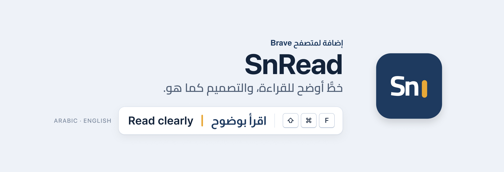
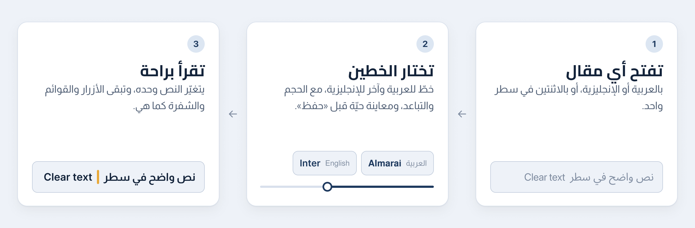
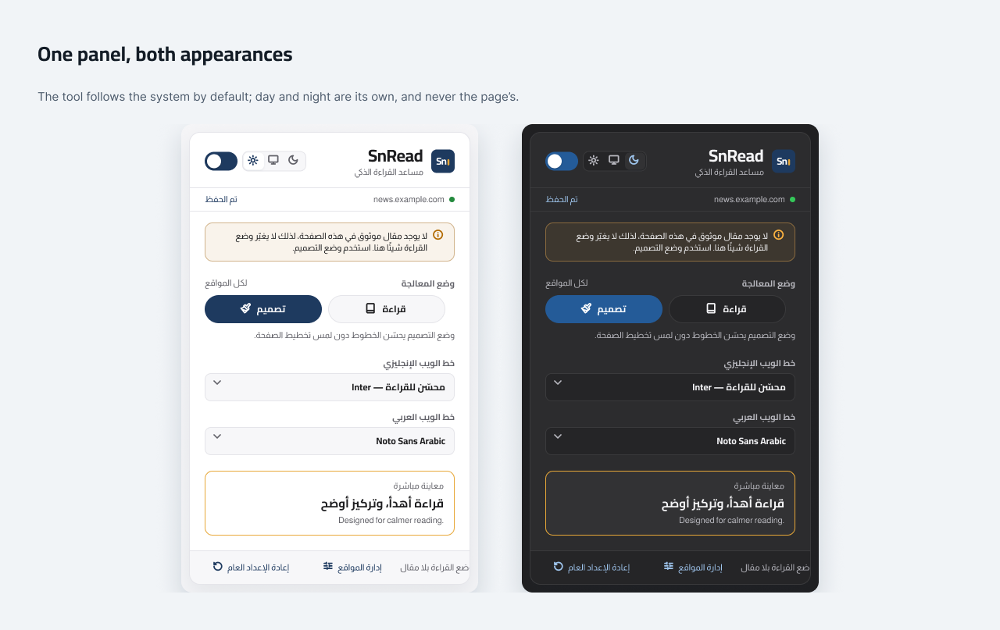

<picture>
  <source media="(prefers-color-scheme: dark)" srcset="docs/assets/header-ar-dark.png">
  
</picture>

### [⬇︎ تنزيل أحدث إصدار](https://github.com/iSltanX/SnRead/releases/latest)

مجاني ومفتوح المصدر · Brave وChromium 111 أو أحدث · Manifest V3

[الفكرة](#الفكرة) · [طريقة العمل](#طريقة-العمل) · [الميزات](#الميزات) · [التثبيت](#التثبيت) · [الاستخدام](#الاستخدام) · [لقطات الشاشة](#لقطات-الشاشة) · [الخصوصية](#الخصوصية) · [الأسئلة المتكررة](#الأسئلة-المتكررة)

---

## الفكرة

كثير من المواقع تعرض العربية بخط لم يُصمَّم لها، أو بخط واحد يخدم الإنجليزية ويُهمل العربية. وأدوات تغيير الخط المعتادة تحرّك تخطيط الصفحة وتكسر أيقوناتها.

إضافة **SnRead** لمتصفح Brave تحسّن قراءة العربية والإنجليزية دون أن تكسر تصميم الموقع: خط للعربية وآخر للإنجليزية، حتى داخل السطر الواحد، ويتغيّر الحجم والتباعد في فقرات المقال وحدها.

---

## طريقة العمل

<picture>
  <source media="(prefers-color-scheme: dark)" srcset="docs/assets/steps-ar-dark.png">
  
</picture>

اللوحة تعرض معاينة حيّة بالحجم نفسه الذي سيظهر على الصفحة، ولا يُحفظ شيء حتى تضغط «حفظ». وإن لم تستطع الإضافة العمل على صفحة، تقول لك السبب: صفحة محمية، أو موقع مستثنى، أو صفحة بلا مقال.

---

## الميزات

- **خط لكل لغة.** العربية بخط Noto Sans Arabic أو Cairo أو Almarai، والإنجليزية بخط Inter أو SF Pro أو Helvetica.
- **التخطيط لا يتحرك.** يتغيّر الخط في نص الموقع، أما الحجم والتباعد ففي فقرات النثر وحدها، فتبقى الأزرار والشارات والجداول بمقاساتها.
- **لا يلمس ما لا يخصّه.** الحقول والمحررات والأزرار والشفرة وخطوط الأيقونات والتنقل وترويسة الموقع تبقى كما هي.
- **وضعان.** وضع التصميم المحافظ، ووضع القراءة الذي يرفض الصفحات التي لا تحوي مقالًا حقيقيًا.
- **قواعد لكل موقع.** استثناءات وتخصيصات لكل نطاق، ونسخة احتياطية بصيغة JSON.
- **لا يغيّر الألوان.** المظهر الفاتح والداكن يخصّان واجهة SnRead وحدها، لا الموقع.

---

## التثبيت

1. نزّل ملف `snread-….zip` من [صفحة الإصدارات](https://github.com/iSltanX/SnRead/releases/latest)، وفكّه في مجلد دائم.
2. افتح `brave://extensions` وفعّل **Developer mode** أعلى الصفحة.
3. اضغط **Load unpacked**، واختر المجلد الذي فيه `manifest.json`.
4. ثبّت SnRead في شريط الأدوات، وافتح لوحته لضبط الخطين.

> لا تنقل المجلد بعد التثبيت: المتصفح يربط الإضافة بمكانه، فنقله يعني إضافة جديدة بإعدادات فارغة.

### المتطلبات

- متصفح Brave، أو أي متصفح مبني على Chromium بالإصدار 111 أو أحدث.
- لا يعمل على Firefox.

---

## الاستخدام

| الإجراء | macOS | Windows وLinux |
| --- | --- | --- |
| تشغيل SnRead أو إيقافه | <kbd>⇧</kbd><kbd>⌘</kbd><kbd>F</kbd> | <kbd>Ctrl</kbd><kbd>Shift</kbd><kbd>F</kbd> |
| تكبير الخط | <kbd>⇧</kbd><kbd>⌘</kbd><kbd>.</kbd> | <kbd>Ctrl</kbd><kbd>Shift</kbd><kbd>.</kbd> |
| تصغير الخط | <kbd>⇧</kbd><kbd>⌘</kbd><kbd>,</kbd> | <kbd>Ctrl</kbd><kbd>Shift</kbd><kbd>,</kbd> |
| إعادة الحجم | <kbd>⇧</kbd><kbd>⌘</kbd><kbd>0</kbd> | <kbd>Ctrl</kbd><kbd>Shift</kbd><kbd>0</kbd> |

- الحجم من 10 إلى 32 بكسل، بخطوة 2 بكسل مع الاختصارات.
- تغيّر الاختصارات من `brave://extensions/shortcuts`.
- زر **إدارة المواقع** في اللوحة يفتح صفحة الاستثناءات وتخصيصات المواقع والنسخ الاحتياطي.

---

## لقطات الشاشة

   
  اللوحة بالوضعين: الخطان، والحجم والتباعد، والمعاينة الحيّة، وزر «حفظ».

---

## الخصوصية

- **إذنان فقط:** `storage` لحفظ الإعدادات محليًا، و`activeTab` الذي يمنحه المتصفح لحظة فتح اللوحة أو ضغط اختصار، لمعرفة عنوان التبويب الحالي وحده.
- **لا شبكة:** لا يرسل شيئًا من الصفحات أو التصفح أو الإعدادات إلى أي خادم، ولا تحليلات ولا تتبّع.
- **الخطوط مضمَّنة** في الإضافة، ولا يُحمَّل شيء من الإنترنت.

التفاصيل، ومنها ما تستطيع الصفحة نفسها ملاحظته، في [PRIVACY.md](PRIVACY.md).

---

## الأسئلة المتكررة

<strong>هل يكسر SnRead تصميم المواقع؟</strong>
 

صُمّم ألّا يفعل: الحجم والتباعد يتغيّران في فقرات المقال وحدها، وخطوط الأيقونات والشفرة والحقول والتنقل لا تُمسّ، والألوان لا تتغيّر أبدًا. وإن ظهرت مشكلة في موقع، استثنِه من اللوحة.

<strong>لماذا لم يحدث شيء على هذه الصفحة؟</strong>
 

اللوحة تقول السبب: صفحات المتصفح الداخلية ومتجر الإضافات محمية، أو الموقع مستثنى، أو وضع القراءة لم يجد مقالًا حقيقيًا. والتبويبات المفتوحة قبل تثبيت الإضافة تحتاج إعادة تحميل مرة واحدة.

<strong>كيف أوقفه على موقع واحد؟</strong>
 

من اللوحة: خيار استثناء هذا الموقع، ويشمل نطاقاته الفرعية. ولإيقافه في كل مكان، استخدم المفتاح الرئيسي في اللوحة أو الاختصار.

<strong>هل يعرف الموقع أنني أستخدم SnRead؟</strong>
 

يمكنه ذلك: تغيير الخط يتطلب ورقة أنماط داخل الصفحة، وهي مقروءة لسكربتات الموقع. لكن لا شيء يغادر جهازك إلى SnRead. ولإخفاء الأثر على موقع بعينه، استثنِه.

<strong>هل يعمل على Chrome أو Edge؟</strong>
 

الإضافة مبنية لـ Brave ومختبرة عليه، وتعمل على المتصفحات المبنية على Chromium بالإصدار 111 أو أحدث. أما Firefox فلا.

<strong>كيف أحدّثه دون أن أفقد إعداداتي؟</strong>
 

استبدل الملفات داخل المجلد نفسه بملفات الإصدار الجديد، ثم اضغط **Reload** على بطاقة SnRead في `brave://extensions`. وإن احتجت إلى نقل المجلد، صدّر إعداداتك من **إدارة المواقع** أولًا.

<strong>كيف أزيله تمامًا؟</strong>
 

من `brave://extensions` اضغط **Remove**، فتُحذف إعداداته معه. ولمسحها دون إزالته: **إدارة المواقع ← إعادة الضبط**.

---

## للمطوّرين

<b>الفحص والحزم</b>
 

لا اعتماديات ولا خطوة بناء. الفحص يحتاج Node.js 20 أو أحدث.

| الأمر | ما يفعله |
| --- | --- |
| `npm run verify` | فحص الملفات، ثم الاختبارات |
| `npm run package` | ينشئ `dist/snread-<version>.zip` |
| `npm run harness` | صفحات تجربة محلية للمحرك واللوحة |
| `npm run qa:browser` | اختبارات Playwright في متصفح حقيقي |

القيم الافتراضية في `src/shared/settings.js`. وسكربت المحتوى لا يستطيع استيراد `src/shared/*` في Manifest V3، فيكرر العقد داخليًا، ويقارن `tests/contract.test.mjs` النسختين تلقائيًا. سجل التغييرات في [CHANGELOG.md](CHANGELOG.md).

## الرخصة

مرخَّص بـ[MIT](LICENSE). الخطوط من Google Fonts برخصة SIL Open Font License 1.1، ونصوصها في [assets/fonts/licenses](assets/fonts/licenses). وهندسة أيقونات الواجهة مبنية على مجموعة [Lucide](https://lucide.dev) بترخيص ISC.

---

**تصميم وتطوير: سلطان** · Designed & developed by Sultan

الموقع: [bysltan.com](https://www.bysltan.com)

من الصانع نفسه 
إضافات المتصفح: [صَوْب](https://github.com/iSltanX/SAWB) · [جسور](https://github.com/iSltanX/Jusoor) 
تطبيقات macOS: [بدّل](https://github.com/iSltanX/Baddel) · [رفّ](https://github.com/iSltanX/Raff) · [Luma](https://github.com/iSltanX/Luma) · [نفّذ](https://github.com/iSltanX/naffith)

[سجل التغييرات](CHANGELOG.md) · [الخصوصية](PRIVACY.md) · [الإصدارات](https://github.com/iSltanX/SnRead/releases)

