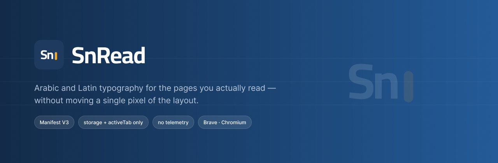
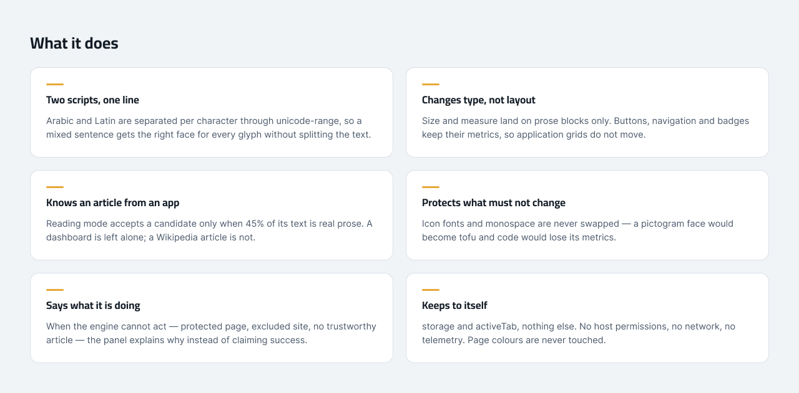
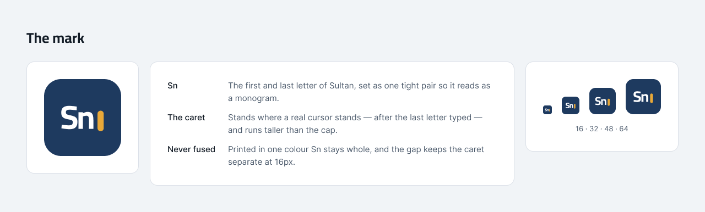

<div align="center">



**إضافة Manifest V3 لمتصفح Brave وChromium تحسّن قراءة العربية والإنجليزية دون أن تحرّك تخطيط الصفحة.**

</div>

---

## ما الذي يفعله SnRead؟



- يفصل العربية واللاتينية تلقائيًا على مستوى المحارف عبر `unicode-range`، حتى داخل السطر المختلط.
- **يغيّر الخط في نص الموقع، ولا يغيّر الحجم أو التباعد إلا في كتل النثر** — فتبقى الأزرار
  والشارات وخلايا الجداول بمقاساتها ولا يتحرك تخطيط الموقع.
- يحمي **خطوط الأيقونات والخطوط أحادية العرض** فقط؛ فتبديلها يحوّل الرموز إلى مربّعات
  ويُفقد الكود مقاساته الثابتة.
- يترك **التنقل والأشرطة الجانبية وترويسة الموقع وتذييله** كما هي عمدًا. أما ترويسة المقال
  وتذييله داخل `<main>` أو `<article>` فهما جزء من المقال ويأخذان الخط مثل بقيته.
- يتجاهل الحقول والمحررات والأزرار والكود وSVG وCanvas.
- يعالج النص داخل **Shadow DOM المفتوح** في وضع التصميم. الإطارات `iframe` والجذور المغلقة
  خارج نطاقه.
- يطبّق قيمة 10–32px على النص الأساسي، ويحافظ على نسب أحجام العناوين — ويتابعها إذا تغيّر
  مقاس النافذة.
- في وضع القراءة يختار «جزيرة نصية» موثوقة: يجب أن يكون **45%** من نص المرشّح نثرًا حقيقيًا،
  فلا تُعامَل قشرةُ تطبيق كأنها مقال. وإن لم يجد مقالًا موثوقًا لم يلمس الصفحة إطلاقًا.
- **لا يغيّر ألوان المواقع في أي وضع.** المظهر النهاري والليلي يخصّان واجهة SnRead وحدها.
- **يقول ما يفعله**: صفحة محمية، أو موقع مستثنى، أو قاعدة موقع تحكم التبويب، أو وضع قراءة بلا
  مقال — تشرح اللوحة السبب بدل إعلان نجاح غير حقيقي.

التفاصيل الفنية في [docs/ARCHITECTURE.md](docs/ARCHITECTURE.md).

## اللوحة وصفحة إدارة المواقع


- الخط العربي: Noto Sans Arabic أو Cairo أو Almarai.
- الخط الإنجليزي: Inter أو SF Pro أو Helvetica. الأخيران يستخدمان نسخة النظام على macOS ولا
  يُعاد توزيعهما.
- خمسة مستويات للحجم، إضافة إلى شريط يدوي من 10px إلى 32px.
- ارتفاع السطر، تباعد الحروف، عرض مساحة النص، وتقليل التشويش البصري. تباعد الحروف يؤثر في
  النص اللاتيني وحده؛ المتصفح لا يباعد الحروف العربية لأنها متصلة، واللوحة تقول ذلك تحت الشريط.
- وضع التصميم المحافظ ووضع القراءة الآمن.
- مظهر الأداة: **يتبع النظام** (الافتراضي) أو نهاري أو ليلي، محفوظ محليًا ولا يغيّر الموقع.
- معاينة عربية/إنجليزية فورية بالحجم نفسه الذي سيظهر على الصفحة.
- اللوحة تحرّر **الإعداد العام**، إلا إذا كانت للتبويب الحالي قاعدة موقع خاصة: عندها تحرّر تلك
  القاعدة وتسمّيها في شريط التنبيه، تمامًا كما تفعل اختصارات لوحة المفاتيح.

زر **إدارة المواقع** يفتح صفحة كاملة لإضافة الاستثناءات، وتحرير تخصيصات المواقع، والنسخ
الاحتياطي بصيغة JSON. تعديلات المحرر **معاينة مؤقتة** حتى تضغط «حفظ التخصيص».

## الهوية



الشعار **`Sn|`**: أول حرفين من **سلطان** — أوّله وآخره — مضبوطين بخط **Cairo Bold** نفسه الذي
تستعمله الواجهة، يليهما مؤشر الكتابة.

المؤشر ليس زخرفة: يقف حيث يقف مؤشر حقيقي، بعد آخر حرف كُتب، جالسًا على خط القاعدة إلى جوار
الـ`n` — طويلًا بما يكفي ليُقرأ مؤشرًا، وقصيرًا بما يكفي ألّا يُقرأ حرفًا ثالثًا. والمسافة
بينه وبين الحروف مضبوطة على أصغر حجم يُستعمل فيه الشعار: عند 32px تُقرأ `Sn` بوضوح والمؤشر
منفصل، وعند 16px يبقى علامة كهرمانية مستقلة. ولا يُدمج المؤشر في أي حرف أبدًا: اطبع الشعار
بلون واحد وتبقى `Sn` كاملة، فيصمد في أيقونة أحادية اللون أو على سطح محفور.

الأزرق العميق `#1E3A5F` يحمل المنتج، والكهرماني `#E8A838` لون شكل لا لون نص — كنصّ على أبيض
يعطي 2.08:1 فقط، لذلك يقتصر على المؤشر والحواف والمؤشرات البصرية. تحمل **Cairo** العناوين
والعناصر الوظيفية، و**Almarai** النصوص والوصف، مع دعم RTL كامل وأرضية 11px لا ينزل تحتها أي
نص في الواجهة.

تفاصيل الرموز والمقاييس والحالات في [docs/DESIGN-SYSTEM.md](docs/DESIGN-SYSTEM.md)،
وهندسة الشعار في [assets/icons/README.md](assets/icons/README.md).

## الأذونات

`storage` فقط، إضافةً إلى `activeTab` الذي يُمنح لحظة فتح اللوحة أو ضغط اختصار ولا يُظهر أي
تحذير عند التثبيت. لا توجد `host_permissions`؛ سكربت المحتوى ثابت في `manifest.json`، ولا
يغادر أي شيء جهازك. راجع [PRIVACY.md](PRIVACY.md).

## التشغيل في Brave

1. افتح `brave://extensions`.
2. فعّل **Developer mode** أعلى الصفحة.
3. اضغط **Load unpacked**.
4. اختر مجلد المشروع الذي يحتوي `manifest.json`.
5. ثبّت SnRead في شريط الأدوات، ثم افتح Popup لضبط الخطوط.

لا يحتاج المشروع إلى تثبيت حزم أو خطوة Build. جميع السكربتات والخطوط والأيقونات محلية.

## اختصارات لوحة المفاتيح على macOS

| الإجراء | الاختصار الافتراضي |
|---|---|
| تكبير الخط (خطوة 2px داخل 10–32) | `⌘ ⇧ .` |
| تصغير الخط (خطوة 2px داخل 10–32) | `⌘ ⇧ ,` |
| إعادة الحجم | `⌘ ⇧ 0` |
| تشغيل/إيقاف SnRead | `⌘ ⇧ F` |

يمكن تغيير الاختصارات من `brave://extensions/shortcuts`. قد يترك Brave اختصارًا فارغًا إذا كان
محجوزًا من النظام أو من إضافة أخرى.

إذا كانت للصفحة الحالية قاعدة موقع خاصة، تعدّل الاختصارات تلك القاعدة لا الإعداد العام، حتى لا
تضغط الاختصار فلا يحدث شيء. وعند بلوغ حدّ المدى (10px أو 32px) تومض الشارة بالقيمة الحالية بدل
ألّا يحدث شيء صامتًا.

## أثر الإضافة على الصفحات

قِيس على صفحات حقيقية بـLighthouse، مرة بالإضافة ومرة بدونها:

| ما قِيس | النتيجة |
|---|---|
| سرعة التحميل | بلا فرق يُذكر — FCP وLCP وSpeed Index كما هي، وTBT صفر على المقالات |
| الوصولية | درجات متطابقة تمامًا، ونفس قائمة التدقيقات الساقطة |
| قشرات التطبيقات | بلا أثر يُذكر؛ وضع القراءة يرفضها فلا يفعل شيئًا |
| ثبات التخطيط | CLS يرتفع على المقالات — نحو 92% منه تبديل الخط نفسه، وهو وظيفة الإضافة |

المصفوفة الكاملة وتفكيك الأرقام في [docs/QA.md](docs/QA.md).

## تعديل الإعدادات لاحقًا

القيم الافتراضية والقوائم والأوضاع في `src/shared/settings.js`. عند إضافة حقل جديد:

1. أضفه إلى `DEFAULT_SETTINGS` ودالة `sanitizeSettings`.
2. أضف التحكم إلى Popup أو صفحة Options.
3. استخدم المفتاح نفسه داخل `src/content/content.js`.
4. أضف اختبارًا في `tests/settings.test.mjs`.

تعليمات إضافة الخطوط في [assets/fonts/README.md](assets/fonts/README.md). لا تُضف خطوطًا
تجارية إلى الحزمة دون ترخيص توزيع؛ SF Pro وHelvetica معرَّفان كخطوط نظام فقط.

لأن Manifest V3 يحقن سكربتات المحتوى كسكربتات كلاسيكية، لا يستطيع `src/content/content.js`
استيراد `src/shared/*`، فهو يكرر العقد داخليًا. يقارن `tests/contract.test.mjs` النسختين
تلقائيًا، فأي تعديل على العقد يجب أن ينعكس في الملفين معًا.

## التحقق والحزم

يتطلب التحقق Node.js 20 أو أحدث، ولا توجد Dependencies خارجية:

```bash
npm run verify
npm run package
```

ينشئ أمر الحزم `dist/snread-<version>.zip` ويضع `manifest.json` في جذر الملف، جاهزًا للفحص أو
الرفع إلى المتجر. مصفوفة الاختبار وبيئة التشغيل المحلية موثقة في [docs/QA.md](docs/QA.md).

قبل النشر، اختبر مواقع عربية وإنجليزية ونصًا مختلطًا، ثم YouTube وGmail وX وموقعًا يستخدم خط
المتصفح الافتراضي. تحقّق أن الخط تغيّر وأن التخطيط لم يتحرك.

---

<div align="center">

تطوير وتصميم: **سلطان**

</div>
